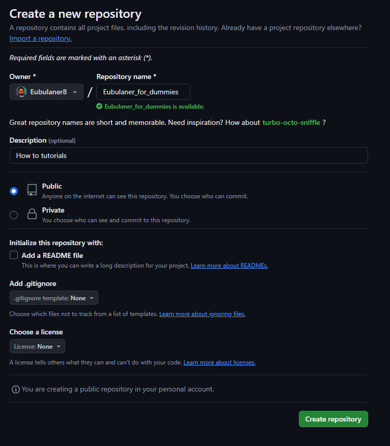
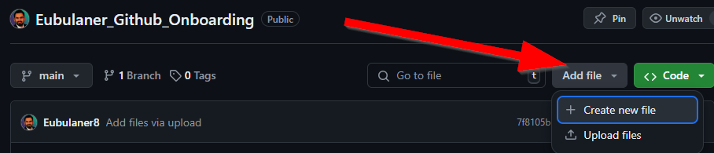
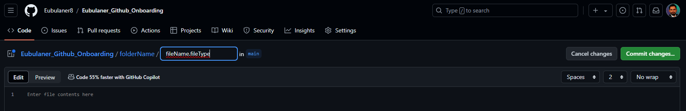

<!-- Hello World I am a comment line, which is visiable only in changing mode -->

<!-- https://docs.github.com/en/repositories -->

<!-- Collapsed Section 1 -->

 
How to create a new Repo in Github?

<picture>
 
</picture>

<picture>
 
</picture>

# How to add a File?

<picture>
 
</picture>

<picture>
 
</picture>

# How to add a Folder?

<picture>
 
</picture>

 <!-- Collapsed Section 1 -->

<!-- Collapsed Section 2 -->

 
  
Mark Down File Hacks

<!-- Headings -->
#   Use #   for first  level heading
##  Use ##  for second level heading
### Use ### for third  level heading

<!-- Table -->
| ID | Name       |
|----|------------|
|   1| Eubulaner 1|
|   2| Eubulaner 2|
|   3| Eubulaner 3|

 <!-- Collapsed Section 2 -->
