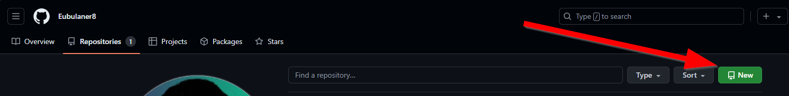

<!-- Hello World I am a comment line, which is visiable only in changing mode -->

# How to create a new Repo in Github?

<picture>
 
</picture>

<picture>
 
</picture>

<picture>
 
</picture>

<picture>
 
</picture>

<picture>
 
</picture>

<!-- Headings -->
#   Use #   for first  level heading
##  Use ##  for second level heading
### Use ### for third  level heading

<!-- https://docs.github.com/en/repositories -->
