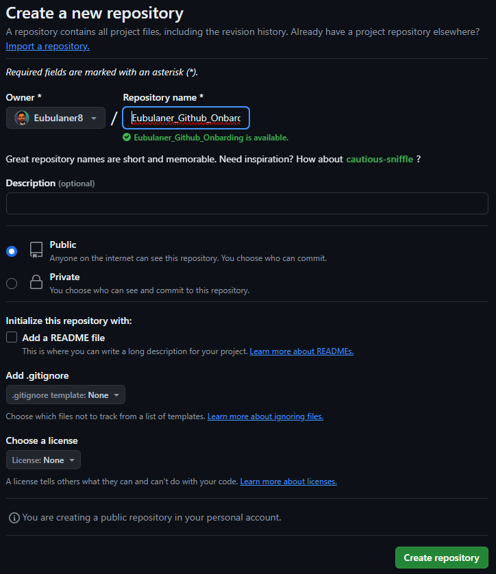
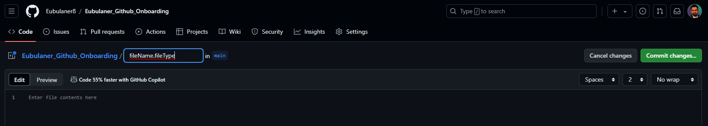
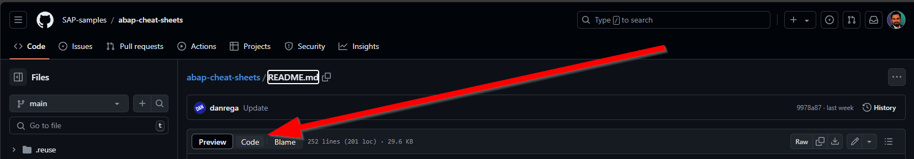

<!-- Hello World I am a comment line, which is visiable only in changing mode -->

<!-- https://docs.github.com/en/repositories -->

<!-- Collapsed Section 1 -->
<details>
 <summary>How to create a new Repo in Github?</summary>

# $${\color{#634CE4}How \space to \space add \space a \space Repo}$$

> Press New Button/

<picture>
 
</picture>

> Fill Repo Name and choose "Add a README file" and press  /

<picture>
 
</picture>

# How to add a File?

<picture>
 
</picture>

<picture>
 
</picture>

# How to add a Folder?

<picture>
 
</picture>

# How to analyse .md files

<picture>
 
</picture>

<!--<picture>
 
</picture>

<picture>
 
</picture> -->

| Preview | Code |
| --- | --- |
| <picture></picture> | <picture></picture> |

</details> <!-- Collapsed Section 1 -->

<!-- Collapsed Section 2 -->

<details> 
  <summary>Mark Down Syntax Hacks</summary>

<!-- Headings -->
# Headings
Use #   for first  level heading\
Use ##  for second level heading\
Use ### for third  level heading

# Styling text
**For bold text use two * in the beginning and in the end with no space**\
__You can also use two _ instead of * as well__\
*For italic use only one * or _ in the beginning and in the end*\
~~ To cross a word use two ~ in the beginning and in the end

#Quotes
> Wise man(@Eubulaner8) said once, use an > to create a quote in Markdown Language 

> Wise man said another time use Back Slash at the end to create a new line

> Wise man keeps saying, to quote a code use backticks(which can be found in the next Quote) in the beginning and in the and command `git clone`

> Wise man adds, if you want to a block of code then use make two lines with three ` and put your code in between
```
Welcome to the SAP BTP command line interface (client v2.8.0)

Usage: btp [OPTIONS] ACTION [GROUP/OBJECT] [PARAMS]

CLI server URL:                    not set
User:                              not set
Configuration:                     /home/user/.cache/.btp/config.json

You are currently not logged in.

Tips:
  To log in to a global account of SAP BTP, use 'btp login'. For help on login, use 'btp --help login'.
  To display general help, use 'btp --help'.

OK
```

somehow alers are not working !!!
> [!NOTE]
> Wise man notes, if you wrap !NOTE in between [] then you create a note 

> [!TIP]
> Wise man shares, if you wrap !TIP in between [] then you create a tip

> [!IMPORTANT]
> Wise man informs, if you wrap !IMPORTANT in between [] then you create a info

> [!WARNING]
> Wise man warns, if you wrap !WARNING in between [] then you create a warning

> [!CAUTION]
> Wise mans wife is coming be careful

# Links
> Wise man goes online and says to create a link wrap link text in [] and wrap URL in () with no space in between ](\

[Syntax Guide](https://www.markdownguide.org/basic-syntax/)
Reference Documentation [GitHub Docs](https://docs.github.com/en/get-started/writing-on-github/getting-started-with-writing-and-formatting-on-github/basic-writing-and-formatting-syntax)\
You can also create relative links if you replace URL with the path of the document that you want to jump. [Jump to README](README.md)

<!-- Table -->
# Table

| ID | Name       |
|----|------------|
|   1| Eubulaner 1|
|   2| Eubulaner 2|
|   3| Eubulaner 3|

# List 

- use -
- or *
+ or + to create unordered list

1. use numbers which ends with a .
2. to crete ordered list

- if you want to create a nested list
  - then put the sign excatly under first letter of the header line and leave a space
 
# Tasks

- [x] its like unordered list with [] between - and the text

# Colors

$${\color{purple} This \space is \space purple \space Color}$$\
$${\color{#634CE4} Eubuleus Color \space hash \space Code}$$

# Emojis, without them Wise man can survive

[Full List of Emojis :technologist:](https://github.com/ikatyang/emoji-cheat-sheet/blob/master/README.md)

Wise man last sentence comes as a footnote which should come after ^1 which is wrapped in []: [^1].
"Mein Arbeitsplatz ist sicher. Niemand will ihn." [^2].

</details> <!-- Collapsed Section 2 -->

[^1]: [Markdown Guide Basic Syntax](https://www.markdownguide.org/basic-syntax/)\
[^2]: [GitHub Docs](https://docs.github.com/en/get-started)\

